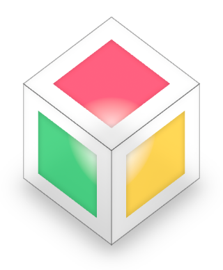
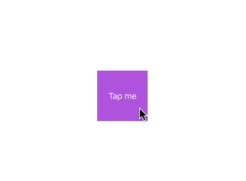
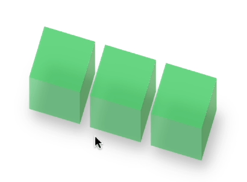
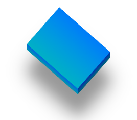
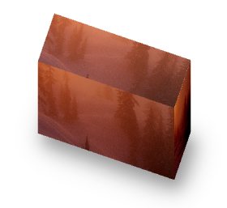
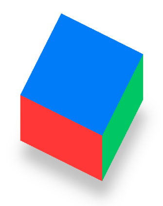
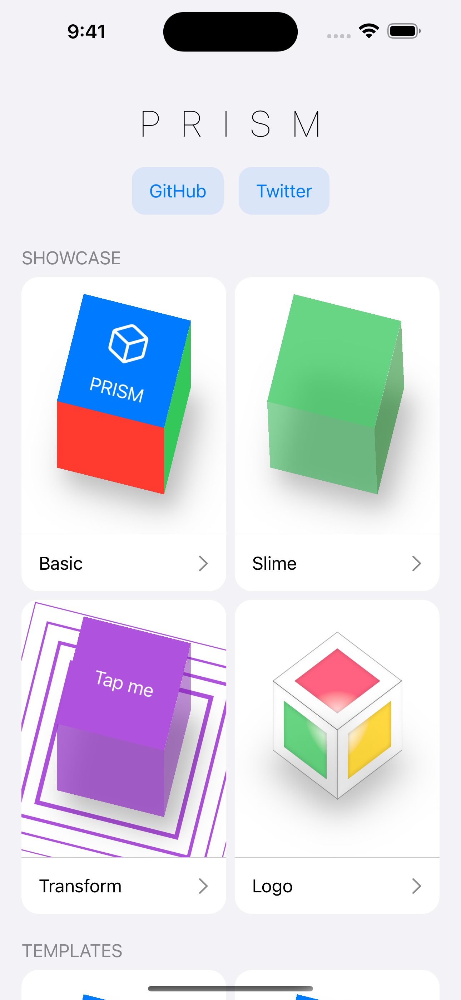

# Prism

A lightweight 3D renderer for SwiftUI.

- Works with any SwiftUI `View`.
- Fully interactive and animatable.
- Compatible with all SwiftUI modifiers.
- No positioning side effects, unlike GeometryReader.
- 100% SwiftUI — no SceneKit, SpriteKit, etc.
- Powered by perspective transforms, so it's fast.
- Supports sizing, extrusion, levitation, and more.
- Compose complex scenes with a familiar API.

 |  |  |  | 
--- | --- | --- | --- | ---

## Installation

Requires iOS 13+ or macOS Catalina and up. Prism can be installed through the [Swift Package Manager](https://developer.apple.com/documentation/xcode/adding-package-dependencies-to-your-app).

```
https://github.com/aheze/Prism
```

## Usage

Prism is designed to be easy to use. First, define a `PrismConfiguration` for customization. Then add a `PrismCanvas`, which can contain as many `PrismView`s as you'd like.

```swift
struct ContentView: View {
    @State var configuration = PrismConfiguration(
        tilt: 0.5, /// A value from 0 to 1, representing the perspective.
        size: CGSize(width: 200, height: 200), /// How big the prism is.
        extrusion: 100, /// The z height.
        levitation: 20, /// How far the prism is from the ground.
        shadowColor: Color.black, /// A dynamic shadow that's rendered underneath the prism.
        shadowOpacity: 0.25 /// The strength of the shadow.
    )

    var body: some View {
        PrismCanvas(tilt: configuration.tilt) {
            PrismView(configuration: configuration) {
                Color.blue
            } left: {
                Color.red
            } right: {
                Color.green
            }
        }
    }
}
```



## Example

The example app includes a bunch of samples to play with. [Download](https://github.com/aheze/Prism/archive/refs/heads/main.zip) it here!



## Customization

Prism supports extensive customization through the [`PrismConfiguration`](https://github.com/aheze/Prism/blob/main/Sources/PrismConfiguration.swift) struct. Check out the example app for an editor!

https://user-images.githubusercontent.com/49819455/192427694-1b91805a-4fc0-4a3a-985f-ac57c0dd8f95.mp4

## Community

Author | Contributing | Need Help?
--- | --- | ---
Prism is made by [aheze](https://github.com/aheze). | All contributions are welcome. Just [fork](https://github.com/aheze/Prism/fork) the repo, then make a pull request. | Open an [issue](https://github.com/aheze/Prism/issues) or join the [Discord server](https://discord.com/invite/Pmq8fYcus2). You can also ping me on [Twitter](https://twitter.com/aheze0). Or read the source code — there's lots of comments.


### Apps Using Prism

[**SwiftUICraft**](https://github.com/aheze/SwiftUICraft) is Minecraft but made with Prism. You can move, add blocks, add water, switch worlds, and more. Thanks to Prism it's 100% SwiftUI with literally nothing else!

https://user-images.githubusercontent.com/49819455/200998762-50a279ca-6460-4aa9-bb85-0d1b96c580ed.mp4

[**Find**](http://getfind.app) is an app for browsing photos. Prism is used in the onboarding screen — download to check it out!

https://user-images.githubusercontent.com/49819455/192427675-c66ca9fa-48f7-4730-92b3-d0d58fdf72c4.mp4


If you have an app that uses Prism, just make a PR or [message me](https://twitter.com/aheze0).

## License

```
MIT License

Copyright (c) 2022 A. Zheng

Permission is hereby granted, free of charge, to any person obtaining a copy
of this software and associated documentation files (the "Software"), to deal
in the Software without restriction, including without limitation the rights
to use, copy, modify, merge, publish, distribute, sublicense, and/or sell
copies of the Software, and to permit persons to whom the Software is
furnished to do so, subject to the following conditions:

The above copyright notice and this permission notice shall be included in all
copies or substantial portions of the Software.

THE SOFTWARE IS PROVIDED "AS IS", WITHOUT WARRANTY OF ANY KIND, EXPRESS OR
IMPLIED, INCLUDING BUT NOT LIMITED TO THE WARRANTIES OF MERCHANTABILITY,
FITNESS FOR A PARTICULAR PURPOSE AND NONINFRINGEMENT. IN NO EVENT SHALL THE
AUTHORS OR COPYRIGHT HOLDERS BE LIABLE FOR ANY CLAIM, DAMAGES OR OTHER
LIABILITY, WHETHER IN AN ACTION OF CONTRACT, TORT OR OTHERWISE, ARISING FROM,
OUT OF OR IN CONNECTION WITH THE SOFTWARE OR THE USE OR OTHER DEALINGS IN THE
SOFTWARE.
```
